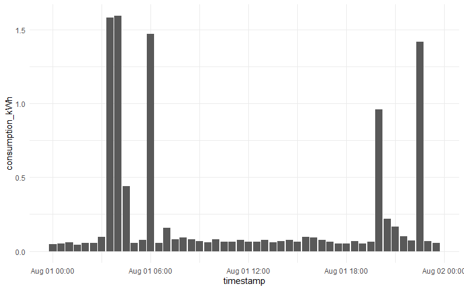

<!-- README.md is generated from README.Rmd. Please edit that file -->

# n3<span style="color:#84aff5">R</span>gy

[n3rgy](https://data.n3rgy.com/consumer/home) provide UK energy
consumers with free access to their smart meter data, enabling people to
track their energy use over time.

This R package, n3**R**gy, provides a lightweight interface with the
consumer API. This is not an official product of n3rgy.

## Get Started

Before using this package you will need to have followed the steps on
n3rgy’s [website](https://data.n3rgy.com/consumer/home), providing the
MPxN and MAC numbers for smart meter you want data from. These numbers
should both be accessible from your smart meter’s In-Home Display (IHD).

Retain a copy of your MAC number to hand as this will be needed when
interfacing with the API.

With that done, its time to install the n3Rgy package:

``` r
install.packages("remotes")
remotes::install_github("odaniel1/n3Rgy")
```

## Usage

The package has two functions: `n3rgy_tariff` and `n3rgy_consumption`.
To use both you will need to provide your MAC number.

`n3rgy_tariff` returns information about your current and previous
energy tariffs, including your daily standing charge and price per
kilowatt hour at half-hour intervals.

``` r
library(n3Rgy)
# Examples WILL NOT RUN without a valid MAC number
my_mac <- "<insert your MAC here>"

tariff <- n3rgy_tariff(my_mac, from = "2023-08-01", to = "2023-08-01")

tariff$standing_charge
```

    #>            timestamp standing_charge_p
    #> startDate 2023-08-01              56.7

``` r
head(tariff_example$price_per_kWh)
```

    #>             timestamp price_per_kWh_p
    #> 1 2023-08-01 00:00:00          31.053
    #> 2 2023-08-01 00:30:00          31.053
    #> 3 2023-08-01 01:00:00          31.053
    #> 4 2023-08-01 01:30:00          31.053
    #> 5 2023-08-01 02:00:00          31.053
    #> 6 2023-08-01 02:30:00          31.053

Whilst `n3rgy_consumption` returns the electricity consumed, aggregated
to half-hour intervals.

``` r
consumption <- n3rgy_consumption(my_mac, from = "2023-08-01", to = "2023-08-01")

library(ggplot2)

ggplot(consumption) +
  geom_col(aes(timestamp, consumption_kWh)) +
  theme_minimal()
```


